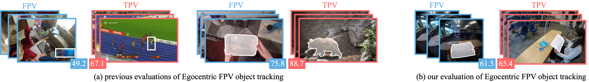

# Visual Object Tracking in First Person Egocentric Vision



This repository helps you implement and evaluate visual object tracking and segmentation (both bounding-box-based and mask-based algorithms) on first-person egocentric datasets. Specifically, the code allows you to reproduce the experiments and results from our recent papers:


## [ICCV 2025] [Is Tracking really more challenging in First Person Egocentric Vision?](https://machinelearning.uniud.it/datasets/vista/)

For instructions on how to download and use the toolkit to run experiments on the VISTA benchmark see [this file](./VISTA.md).

## [IJCV 2023] [Visual Object Tracking in First Person Vision](https://machinelearning.uniud.it/datasets/trek150/)

For instructions on how to download and use the toolkit to run experiments on the TREK-150 benchmark see [this file](./TREK150.md).


## For any issue or inquiry:
**Contact:** [matteo.dunnhofer@uniud.it](mailto:matteo.dunnhofer@uniud.it)


## Citing
When using the datasets or toolkit, please reference:

```
@InProceedings{VISTAiccv,
author = {Dunnhofer, Matteo and Manigrasso, Zaira and Micheloni, Christian},
title = {Is Tracking really more challenging in First Person Egocentric Vision?},
booktitle = {Proceedings of the IEEE/CVF International Conference on Computer Vision (ICCV)},
month = {Oct},
year = {2025}
}

@Article{TREK150ijcv,
author = {Dunnhofer, Matteo and Furnari, Antonino and Farinella, Giovanni Maria and Micheloni, Christian},
title = {Visual Object Tracking in First Person Vision},
journal = {International Journal of Computer Vision (IJCV)},
year = {2022}
}

@InProceedings{TREK150iccvw,
author = {Dunnhofer, Matteo and Furnari, Antonino and Farinella, Giovanni Maria and Micheloni, Christian},
title = {Is First Person Vision Challenging for Object Tracking?},
booktitle = {Proceedings of the IEEE/CVF International Conference on Computer Vision (ICCV) Workshops},
month = {Oct},
year = {2021}
}
```

## License
All files in this dataset are copyright by us and published under the 
Creative Commons Attribution-NonCommercial 4.0 International License, found 
[here](https://creativecommons.org/licenses/by-nc/4.0/).
This means that you must give appropriate credit, provide a link to the license,
and indicate if changes were made. You may do so in any reasonable manner,
but not in any way that suggests the licensor endorses you or your use. You
may not use the material for commercial purposes.

Copyright © Machine Learning and Perception Lab - University of Udine - 2021 - 2025


### Acknowledgments
We thank the authors of the [GOT-10k](http://got-10k.aitestunion.com), [EPIC-Kitchens](https://epic-kitchens.github.io/), and [EgoExo4D](https://ego-exo4d-data.org) datasets for inspiring our work. The code in this repository heavily borrows from their original repositories.

Consider citing the original resources when using our code and datasets:
```
@Article{8922619,
author={Huang, Lianghua and Zhao, Xin and Huang, Kaiqi},
journal={IEEE Transactions on Pattern Analysis and Machine Intelligence}, 
title={GOT-10k: A Large High-Diversity Benchmark for Generic Object Tracking in the Wild}, 
year={2021},
volume={43},
number={5},
pages={1562-1577},
doi={10.1109/TPAMI.2019.2957464}
}

@InProceedings{Damen2018EPICKITCHENS,
title={Scaling Egocentric Vision: The EPIC-KITCHENS Dataset},
author={Damen, Dima and Doughty, Hazel and Farinella, Giovanni Maria  and Fidler, Sanja and 
        Furnari, Antonino and Kazakos, Evangelos and Moltisanti, Davide and Munro, Jonathan 
        and Perrett, Toby and Price, Will and Wray, Michael},
booktitle={European Conference on Computer Vision (ECCV)},
year={2018}
} 

@InProceedings{grauman2024ego,
title={Ego-exo4d: Understanding skilled human activity from first-and third-person perspectives},
author={Grauman, Kristen and Westbury, Andrew and Torresani, Lorenzo and Kitani, Kris and Malik, Jitendra and Afouras, Triantafyllos and Ashutosh, Kumar and Baiyya, Vijay and Bansal, Siddhant and Boote, Bikram and others},
booktitle={Proceedings of the IEEE/CVF Conference on Computer Vision and Pattern Recognition (CVPR)},
year={2024}
}
```