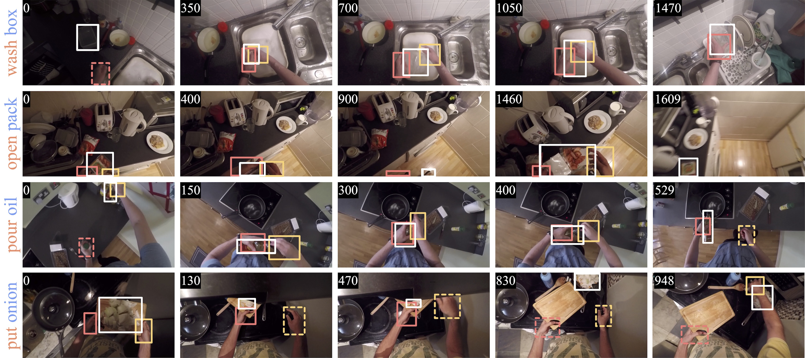

# [Visual Object Tracking in First Person Vision](https://machinelearning.uniud.it/datasets/trek150/)
## The TREK-150 Benchmark Dataset and Toolkit

<!-- start badges -->
[](https://arxiv.org/abs/2209.13502)
[](http://arxiv.org/abs/2108.13665)
<!-- end badges -->



> The understanding of human-object interactions is fundamental in First Person Vision (FPV). Visual tracking algorithms which follow the objects manipulated by the camera wearer can provide useful information to effectively model such interactions. In the last years, the computer vision community has significantly improved the performance of tracking algorithms for a large variety of target objects and scenarios. Despite a few previous attempts to exploit trackers in the FPV domain, a methodical analysis of the performance of state-of-the-art trackers is still missing. This research gap raises the question of whether current solutions can be used ``off-the-shelf'' or more domain-specific investigations should be carried out. This paper aims to provide answers to such questions. We present the first systematic investigation of single object tracking in FPV. Our study extensively analyses the performance of 42 algorithms including generic object trackers and baseline FPV-specific trackers. The analysis is carried out by focusing on different aspects of the FPV setting, introducing new performance measures, and in relation to FPV-specific tasks. The study is made possible through the introduction of TREK-150, a novel benchmark dataset composed of 150 densely annotated video sequences. Our results show that object tracking in FPV poses new challenges to current visual trackers. We highlight the factors causing such behavior and point out possible research directions. Despite their difficulties, we prove that trackers bring benefits to FPV downstream tasks requiring short-term object tracking. We expect that generic object tracking will gain popularity in FPV as new and FPV-specific methodologies are investigated.

## Authors
Matteo Dunnhofer (1)
Antonino Furnari (2)
Giovanni Maria Farinella (2)
Christian Micheloni (1)

* (1) Machine Learning and Perception Lab, University of Udine, Italy
* (2) Image Processing Laboratory, University of Catania, Italy

**Contact:** [matteo.dunnhofer@uniud.it](mailto:matteo.dunnhofer@uniud.it)


## Citing
When using the dataset or toolkit, please reference:

```
@Article{TREK150ijcv,
author = {Dunnhofer, Matteo and Furnari, Antonino and Farinella, Giovanni Maria and Micheloni, Christian},
title = {Visual Object Tracking in First Person Vision},
journal = {International Journal of Computer Vision (IJCV)},
year = {2022}
}

@InProceedings{TREK150iccvw,
author = {Dunnhofer, Matteo and Furnari, Antonino and Farinella, Giovanni Maria and Micheloni, Christian},
title = {Is First Person Vision Challenging for Object Tracking?},
booktitle = {Proceedings of the IEEE/CVF International Conference on Computer Vision (ICCV) Workshops},
month = {Oct},
year = {2021}
}
```

## The TREK-150 Dataset

The annotations produced for this dataset are contained in [this archive](https://machinelearning.uniud.it/datasets/trek150/TREK-150-annotations.zip) (you will find a zip archive for every sequence contained in TREK-150).
Video frames of the TREK-150's sequences cannot be directly re-distributed due to the EK-55 policy. So you won't directly find them in the annotations folder, but they will be automatically downloaded for you.

The full TREK-150 dataset can be built just by running
```
pip install got10k
git clone https://github.com/matteo-dunnhofer/fpv-tracking-toolkit
cd fpv-tracking-toolkit
python download_trek150.py
```
This will download the original EK-55 MP4 videos, extract the frames of interest using ```ffmpeg```, and prepare the annotation files that will be extracted from the zip archives. After the whole process is completed, you will find 100 directories in the ```dataset``` folder. Each one defines a video sequence.

Each sequence folder will contain a directory

 - ```img/```: Contains the video frames of the sequence as ```*.jpg``` files.

and the following ```*.txt``` files:

 - ```groundtruth_rect.txt```: Contains the ground-truth trajectory of the target object. The comma-separated values on each line represent the bounding-box locations [x,y,w,h] (coordinates of the top-left corner, and width and height) of the target object at each respective frame (1st line -> target location for the 1st frame, last line -> target location for the last frame). A line with values -1,-1,-1,-1 specifies that the target object is not visible in such a frame.
 - ```action_target.txt```: Contains the labels for the action performed by the camera wearer (as verb-noun pair) and the target object category. The file reports 3 line-separated numbers. The first value is the action verb label, the second is the action noun label, the third is the noun label for the target object (action noun and target noun do not coincide on some sequences). The verb labels are obtained considering the ```verb_id``` indices of [this file](https://github.com/epic-kitchens/epic-kitchens-55-annotations/blob/master/EPIC_verb_classes.csv). The noun labels and target noun labels are obtained considering the ```noun_id``` indices of [this file](https://github.com/epic-kitchens/epic-kitchens-55-annotations/blob/master/EPIC_noun_classes.csv).
 - ```attributes.txt```: Contains the tracking attributes of the sequence. The file reports line-separated strings that depend on the tracking situations happening in the sequence. The strings are acronyms and explanations can be found in Table 2 of the main paper.
 - ```frames.txt```: Contains the frame indices of the sequence with respect to the full EK-55 video.
 - ```anchors.txt```: Contains the frame indices of the starting points (anchors) and the direction of evaluation (0 -> forward in time, 1 -> backward in time) to implement the MSE (multi-start evaluation) protocol.
  - ```lh_rect.txt```: Contains the ground-truth bounding-boxes of the camera wearer's left hand. The comma-separated values on each line represent the bounding-box locations [x,y,w,h] (coordinates of the top-left corner, and width and height) of hand at each respective frame (1st line -> target location for the 1st frame, last line -> hand location for the last frame). A line with values -1,-1,-1,-1 specifies that the hand is not visible in such a frame.
 - ```rh_rect.txt```: Contains the ground-truth bounding-boxes of the camera wearer's right hand. The comma-separated values on each line represent the bounding-box locations [x,y,w,h] (coordinates of the top-left corner, and width and height) of hand at each respective frame (1st line -> target location for the 1st frame, last line -> hand location for the last frame). A line with values -1,-1,-1,-1 specifies that the hand is not visible in such a frame.
 - ```lhi_labels.txt```: Contains the ground-truth labels expressing whether the camera wearer's left hand is in contact with the target object. The binary values on each line represent the presence of contact (0 -> no contact, 1 -> contact) between hand and object at each respective frame (1st line -> interaction for the 1st frame, last line -> interaction for the last frame).
 - ```rhi_labels.txt```: Contains the ground-truth labels expressing whether the camera wearer's right hand is in contact with the target object. The binary values on each line represent the presence of contact (0 -> no contact, 1 -> contact) between hand and object at each respective frame (1st line -> interaction for the 1st frame, last line -> interaction for the last frame).
 - ```bhi_labels.txt```: Contains the ground-truth labels expressing whether both camera wearer's hands are in contact with the target object. The binary values on each line represent the presence of contact (0 -> no contact, 1 -> contact) between hands and object at each respective frame (1st line -> interaction for the 1st frame, last line -> interaction for the last frame).
 - ```anchors_hoi.txt```: Contains the frame indices of the starting and ending points (anchors) and the type of interaction(0 -> left hand interaction, 1 -> right hand interaction, 2 -> both hands interaction) to implement the HOI (hand object interaction evaluation) protocol.

The code was tested with Python 3.7.9 and ```ffmpeg``` 4.0.2. All the temporary files (e.g. ```*.MP4``` files, not relevant frames) generated during the download procedure will be removed automatically after the process is completed. The download process can be resumed from the last downloaded sequence if prematurely stopped.

The download process could take up to 24h to complete.

## Toolkit
The code available in this repository allows you to replicate the experiments and results presented in our paper. Our code is built upon the [```got10k-toolkit```](https://github.com/got-10k/toolkit) toolkit and inherits the same tracker definition. Please check such a GitHub repository to learn how to use our toolkit. The only difference is that you have to change the name of the toolkit when importing the python sources (e.g. you have to use ```from toolkit.experiments import ExperimentTREK150``` instead of ```from got10k.experiments import ExperimentTREK150```). Otherwise, you can try to integrate the orginal ```got10k-toolkit``` with the sources of this repository (it should be easy).

In the following, we provide examplar code to run an evaluation of the [SiamFC tracker](https://github.com/got-10k/siamfc) on the TREK-150 benchmark.
```
git clone https://github.com/matteo-dunnhofer/fpv-tracking-toolkit
cd fpv-tracking-toolkit

# Clone a the GOT-10k pre-trained SiamFC
pip install torch opencv-python got10k
git clone https://github.com/matteo-dunnhofer/siamfc-pytorch.git siamfc_pytorch
wget -nc --no-check-certificate "https://drive.google.com/uc?export=download&id=1UdxuBQ1qtisoWYFZxLgMFJ9mJtGVw6n4" -O siamfc_pytorch/pretrained/siamfc_alexnet_e50.pth
      
python example_trek150.py
```
This will download and prepare the TREK-150 dataset if you have not done before.

You can proceed similarly to perform experiments on the [OTB benchmarks](http://cvlab.hanyang.ac.kr/tracker_benchmark/benchmark_v10.html) using our performance measures.
```
git clone https://github.com/matteo-dunnhofer/TREK-150-toolkit
cd TREK-150-toolkit

# Clone a the GOT-10k pre-trained SiamFC
pip install torch opencv-python got10k
git clone https://github.com/matteo-dunnhofer/siamfc-pytorch.git siamfc_pytorch
wget -nc --no-check-certificate "https://drive.google.com/uc?export=download&id=1UdxuBQ1qtisoWYFZxLgMFJ9mJtGVw6n4" -O siamfc_pytorch/pretrained/siamfc_alexnet_e50.pth

python example_otb100.py
```

## Tracker Results
The raw results of the trackers benchmarked in our paper can be downloaded from [this link](https://uniudamce-my.sharepoint.com/:u:/g/personal/matteo_dunnhofer_uniud_it/EbnWz8FPqetPgXErg1SNNhABeBpTrlMMqKFr6xIxreD6UQ?e=2Z8w2C).

## License
All files in this dataset are copyright by us and published under the 
Creative Commons Attribution-NonCommercial 4.0 International License, found 
[here](https://creativecommons.org/licenses/by-nc/4.0/).
This means that you must give appropriate credit, provide a link to the license,
and indicate if changes were made. You may do so in any reasonable manner,
but not in any way that suggests the licensor endorses you or your use. You
may not use the material for commercial purposes.

Copyright © Machine Learning and Perception Lab - University of Udine - 2021 - 2022
